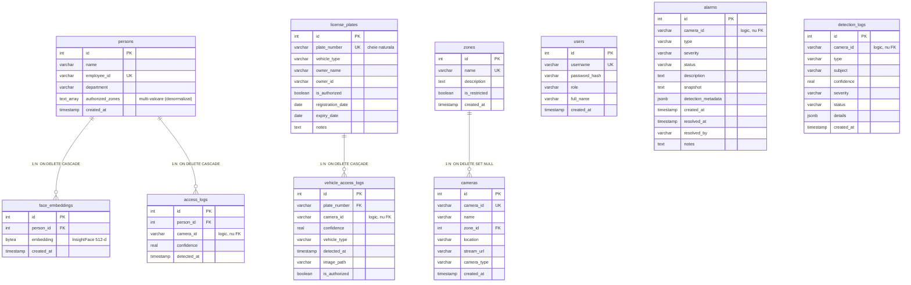

# Diagrama entitate-relație (ERD) — descriere detaliată

Document de lucru pentru realizarea figurii din **§ Proiectarea bazei de date**
(`\label{sec:proiectare_db}`), subsecțiunea *Diagrama entitate-relație*. Sursa de
adevăr este `Facial_detection/database_manager.py` (blocul `CREATE TABLE`,
liniile ~86–228). Schema conține **zece tabele**.

---

## 1. Convenții de notație în diagramă

- **PK (cheie primară)** — atributul se afișează **subliniat**. Toate tabelele
  folosesc o cheie surogat `id SERIAL` (întreg auto-incrementat).
- **FK (cheie străină)** — atributul primește o **săgeată** orientată către
  coloana referită din tabela-părinte. Capătul săgeții (vârful) atinge tabela
  referită.
- **Politica `ON DELETE`** — se notează ca etichetă **pe linia de relație**:
  fie `CASCADE`, fie `SET NULL`.
- **Cardinalitate** — toate relațiile reale sunt **unu-la-mulți** (1 părinte → N
  copii). Se recomandă notația „crow's foot”: capătul „mulți” (copilul) cu
  laba de cioară, capătul „unu” (părintele) cu bară simplă.
- **Constrângeri `UNIQUE`** — se pot marca cu eticheta `(U)` lângă atribut.
- **Atribut multi-valoare** — vezi §4: `persons.authorized_zones` se desenează
  ca atribut tablou (oval dublu / notație `TEXT[]`), **nu** ca entitate.

---

## 2. Cele zece entități (tabele) cu atributele lor

Ordinea coloanelor respectă codul. PK marcat cu `« PK »`, UNIQUE cu `(U)`,
NOT NULL cu `(NN)`, FK cu `« FK → ... »`.

### 2.1 `persons` — persoanele înregistrate
| Atribut | Tip | Note |
|---|---|---|
| **id** | `SERIAL` | « PK » |
| name | `VARCHAR` | |
| employee_id | `VARCHAR(50)` | (U)(NN) |
| department | `VARCHAR` | |
| **authorized_zones** | `TEXT[]` | **atribut multi-valoare** (vezi §4) |
| created_at | `TIMESTAMP` | |

### 2.2 `face_embeddings` — embedding-uri faciale (≈ *person_images* din cerință)
| Atribut | Tip | Note |
|---|---|---|
| **id** | `SERIAL` | « PK » |
| person_id | `INTEGER` | « FK → persons.id », `ON DELETE CASCADE` |
| embedding | `BYTEA` | (NN) — vector InsightFace 512-d serializat binar |
| created_at | `TIMESTAMP` | |

Sursa din care se reconstruiește indexul FAISS la pornire.

### 2.3 `access_logs` — jurnalul accesărilor de persoane
| Atribut | Tip | Note |
|---|---|---|
| **id** | `SERIAL` | « PK » |
| person_id | `INTEGER` | « FK → persons.id », `ON DELETE CASCADE` |
| camera_id | `VARCHAR` | *legătură logică* spre `cameras`, **nu** FK |
| confidence | `REAL` | |
| detected_at | `TIMESTAMP` | |

### 2.4 `license_plates` — plăcuțele de înmatriculare (≈ *plates*)
| Atribut | Tip | Note |
|---|---|---|
| **id** | `SERIAL` | « PK » |
| plate_number | `VARCHAR(20)` | (U)(NN) — **cheie naturală**, țintă de FK |
| vehicle_type | `VARCHAR` | |
| owner_name | `VARCHAR` | |
| owner_id | `VARCHAR` | |
| is_authorized | `BOOLEAN` | `DEFAULT TRUE` |
| registration_date | `DATE` | |
| expiry_date | `DATE` | |
| notes | `TEXT` | |

### 2.5 `vehicle_access_logs` — jurnalul accesărilor de vehicule
| Atribut | Tip | Note |
|---|---|---|
| **id** | `SERIAL` | « PK » |
| plate_number | `VARCHAR` | « FK → license_plates.plate_number », `ON DELETE CASCADE` |
| camera_id | `VARCHAR` | *legătură logică* spre `cameras`, **nu** FK |
| confidence | `REAL` | |
| vehicle_type | `VARCHAR` | |
| detected_at | `TIMESTAMP` | |
| image_path | `VARCHAR` | |
| is_authorized | `BOOLEAN` | |

> Atenție: FK pornește din `plate_number` (nu dintr-un `id`), pentru că referă
> cheia naturală `license_plates.plate_number`.

### 2.6 `users` — conturile de utilizator
| Atribut | Tip | Note |
|---|---|---|
| **id** | `SERIAL` | « PK » |
| username | `VARCHAR(50)` | (U)(NN) |
| password_hash | `VARCHAR` | parola stocată exclusiv ca hash (NF3) |
| role | `VARCHAR(20)` | `DEFAULT 'user'` (alimentează RBAC) |
| full_name | `VARCHAR` | |
| created_at | `TIMESTAMP` | |

### 2.7 `alarms` — alarmele (≈ *alerts*)
| Atribut | Tip | Note |
|---|---|---|
| **id** | `SERIAL` | « PK » |
| camera_id | `VARCHAR` | (NN) — *legătură logică* spre `cameras`, **nu** FK |
| type | `VARCHAR` | (NN) |
| severity | `VARCHAR` | `DEFAULT 'medium'` |
| status | `VARCHAR` | `DEFAULT 'unresolved'` |
| description | `TEXT` | |
| snapshot | `TEXT` | captură JPEG+Base64 la declanșare |
| detection_metadata | `JSONB` | |
| created_at | `TIMESTAMP` | |
| resolved_at | `TIMESTAMP` | |
| resolved_by | `VARCHAR` | |
| notes | `TEXT` | |

### 2.8 `zones` — zonele de supraveghere
| Atribut | Tip | Note |
|---|---|---|
| **id** | `SERIAL` | « PK » |
| name | `VARCHAR(100)` | (U)(NN) — referită prin **nume** de `persons.authorized_zones` |
| description | `TEXT` | |
| is_restricted | `BOOLEAN` | `DEFAULT FALSE` |
| created_at | `TIMESTAMP` | |

### 2.9 `cameras` — registrul persistent de camere
| Atribut | Tip | Note |
|---|---|---|
| **id** | `SERIAL` | « PK » |
| camera_id | `VARCHAR(50)` | (U)(NN) |
| name | `VARCHAR` | |
| zone_id | `INTEGER` | « FK → zones.id », `ON DELETE SET NULL` |
| location | `VARCHAR` | |
| stream_url | `VARCHAR` | |
| camera_type | `VARCHAR` | `DEFAULT 'ip'` |
| created_at | `TIMESTAMP` | |

### 2.10 `detection_logs` — istoricul complet al detecțiilor (≈ *logs*)
| Atribut | Tip | Note |
|---|---|---|
| **id** | `SERIAL` | « PK » |
| camera_id | `VARCHAR` | (NN) — *legătură logică* spre `cameras`, **nu** FK |
| type | `VARCHAR` | (NN) |
| subject | `VARCHAR` | |
| confidence | `REAL` | |
| severity | `VARCHAR` | |
| status | `VARCHAR` | |
| details | `JSONB` | |
| created_at | `TIMESTAMP` | |

Tabelul interogat de `/api/logs` și exportat ca CSV.

---

## 3. Relațiile cu chei străine (săgețile „tari” din diagramă)

Acestea sunt singurele **patru** relații impuse prin chei străine. Fiecare se
desenează ca o linie cu săgeată de la coloana-copil spre coloana-părinte, cu
eticheta politicii `ON DELETE`.

| # | De la (copil) | Spre (părinte) | Cardinalitate | `ON DELETE` |
|---|---|---|---|---|
| R1 | `face_embeddings.person_id` | `persons.id` | N : 1 | **CASCADE** |
| R2 | `access_logs.person_id` | `persons.id` | N : 1 | **CASCADE** |
| R3 | `vehicle_access_logs.plate_number` | `license_plates.plate_number` | N : 1 | **CASCADE** |
| R4 | `cameras.zone_id` | `zones.id` | N : 1 | **SET NULL** |

Interpretare a politicilor:
- **CASCADE** (R1, R2, R3) — ștergerea părintelui șterge automat copiii. Ex.:
  ștergerea unei persoane elimină embedding-urile sale faciale și jurnalele de
  acces; ștergerea unei plăcuțe elimină jurnalul de acces al vehiculului.
- **SET NULL** (R4) — ștergerea unei zone **nu** șterge camera, ci doar îi pune
  `zone_id = NULL` (cameră „orfană”, fără zonă).

---

## 4. Relația persoană–zonă: atribut multi-valoare, NU entitate asociativă

Punctul critic al figurii. Autorizarea pe zone **nu** trece printr-un tabel de
joncțiune `person_zone_authorization`. Ea este **denormalizată** ca tablou de
nume de zone (`authorized_zones TEXT[]`) direct pe `persons`.

**Cum se reprezintă în diagramă:**
- NU se desenează o entitate intermediară între `persons` și `zones`.
- `authorized_zones` se marchează pe `persons` ca **atribut multi-valoare**
  (în notația Chen: oval dublu; în notația crow's-foot/tabelară: se evidențiază
  tipul `TEXT[]`).
- Legătura logică spre `zones` se desenează — dacă se desenează — ca **linie
  punctată** (relație „soft”, neimpusă), etichetată „prin nume, fără FK”, fără
  vârf de săgeată de tip FK și **fără** politică `ON DELETE`.

**De ce așa (compromisul de proiectare):** citire foarte rapidă a zonelor unei
persoane (folosită intens de pipeline-ul multi-threaded, cache-uită în
`_person_zones_cache`), în schimbul pierderii integrității referențiale către
`zones` (zonele sunt referite prin **nume**, nu prin FK; redenumirea/ștergerea
unei zone nu se propagă automat).

---

## 5. Legături logice (la nivel de aplicație, NU chei străine)

Se desenează **punctat** sau se lasă în afara liniilor „tari”; se pot menționa
într-o legendă. Câmpul `camera_id` este `VARCHAR`, **nu** FK către `cameras`:

- `access_logs.camera_id` ⟶ (logic) `cameras.camera_id`
- `vehicle_access_logs.camera_id` ⟶ (logic) `cameras.camera_id`
- `alarms.camera_id` ⟶ (logic) `cameras.camera_id`
- `detection_logs.camera_id` ⟶ (logic) `cameras.camera_id`

Aceste legături nu sunt impuse prin chei străine — decizie care privilegiază
viteza de scriere a jurnalelor în detrimentul integrității referențiale stricte.

---

## 6. Constrângeri `UNIQUE` (de marcat cu „(U)”)

`persons.employee_id`, `license_plates.plate_number`, `users.username`,
`zones.name`, `cameras.camera_id`.

---

## 7. Indecși secundari (opțional, ca adnotare/legendă; nu fac parte din ERD propriu-zis)

- `idx_plate_number` pe `license_plates(plate_number)`
- `idx_detlogs_created_at` pe `detection_logs(created_at DESC)`,
  `idx_detlogs_type` pe `(type)`, `idx_detlogs_camera` pe `(camera_id)`
- `idx_vehicle_access_time` pe `vehicle_access_logs(detected_at)`,
  `idx_vehicle_camera` pe `(camera_id)`
- `idx_alarms_status`, `idx_alarms_type`, `idx_alarms_severity`,
  `idx_alarms_created_at` pe `alarms`
- `idx_cameras_zone` pe `cameras(zone_id)`

---

## 8. Sugestie de așezare în pagină (layout)

```
        persons ──R1(CASCADE)──▶ face_embeddings
           │  └──R2(CASCADE)──▶ access_logs
           ┊ (authorized_zones TEXT[] : atribut multi-valoare)
           ┊  ⋯ legătură logică prin nume ⋯
        zones ◀──R4(SET NULL)── cameras
                                   ▲ ▲ ▲ ▲
                  (legături logice camera_id, punctate)
                  │   │       │          │
        detection_logs  alarms  access_logs  vehicle_access_logs
                                                    ▲
        license_plates ──R3(CASCADE)───────────────┘

        users  (entitate independentă, fără relații FK)
```

- Grup stânga-sus: nucleul **persoane** (`persons`, `face_embeddings`,
  `access_logs`) — legături `CASCADE`.
- Grup dreapta-sus: nucleul **vehicule** (`license_plates`,
  `vehicle_access_logs`) — legătură `CASCADE`.
- Grup centru-jos: **infrastructură** (`zones` ←`SET NULL`— `cameras`) plus
  jurnalele/alarmele care referă camerele doar logic.
- `users` — entitate izolată (autentificare/RBAC), fără chei străine; se așază
  într-un colț liber.

---

## 9. Schiță Mermaid (pentru generare rapidă)

> Notă: Mermaid `erDiagram` nu redă nativ politicile `ON DELETE` și nici
> atributele multi-valoare; ele se adaugă prin etichetele de relație și prin
> tipul `TEXT[]`. Folosiți-o ca punct de plecare, apoi adnotați manual.



---

## 10. Listă de verificare înainte de a considera figura completă

- [ ] Toate cele **10** tabele sunt prezente.
- [ ] Fiecare `id` PK este **subliniat**.
- [ ] Cele **4** relații FK au săgeată spre părinte + etichetă `ON DELETE`
      (3× CASCADE, 1× SET NULL).
- [ ] `persons.authorized_zones` apare ca **atribut multi-valoare** (`TEXT[]`),
      **nu** ca entitate de joncțiune.
- [ ] Legăturile `camera_id` (×4) și persoană–zonă sunt punctate / marcate ca
      „logice, fără FK”.
- [ ] Constrângerile `UNIQUE` (×5) sunt marcate.
- [ ] `users` apare ca entitate independentă (fără FK).
